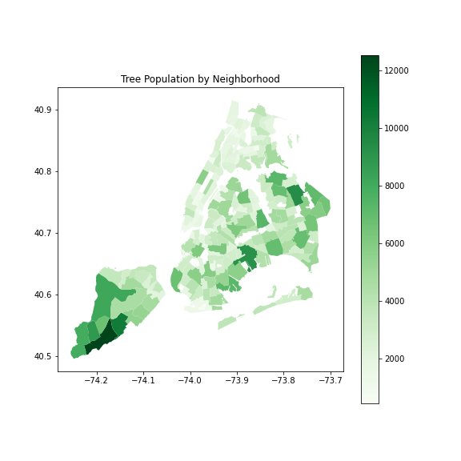

# New York City Tree Health Classification

**Author**: Benjamin Dean

# Overview

Green space is vital to the prosperity* of a city and the welfare of its inhabitants.  It is therefore critical that the New York City Department of Parks and Recreation utilize their resources and funding effectively and efficiently to preserve and promote the health of the city's over five million trees.  A testament to their effort, the Parks department, alongside a crew* of volunteers, has censused data for every public tree located alongside a street.  This project employs three machine learning algorithms to best determine the health of a tree given its collected features.

# Business Problem

* Which factors are most prevalent among trees in poor health?
* Which factors most contribute to a tree's health?

