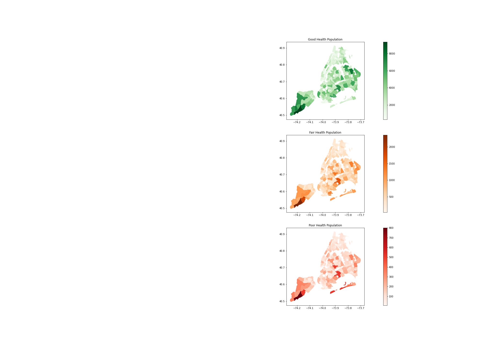

# New York City Tree Health Classification

**Author**: Benjamin Dean

# Overview

Green space is vital to the prosperity of a city and the welfare of its inhabitants. It is therefore critical that the New York City Department of Parks and Recreation utilize their resources and funding effectively and efficiently to preserve and promote the health of the city's over five million trees. A testament to their effort, the Parks department, alongside a crew of volunteers, has censused data for every public tree located alongside a New York City street. The City maintains a website called “NYC Open Data” which provides free public data published by NYC agencies and other parties.  Interested members of the public are invited to learn more about data analysis, download data sets, suggest additional areas of data collection, make comments and to ask questions. The data source for the project is the “2015 Street Tree Census - Tree Data” found on the https://data.cityofnewyork.us/Environment/2015-Street-Tree-Census-Tree-Data/uvpi-gqnh website. The download CSV used to populate the initial dataframe is “2015StreetTrees Census_TREES.csv.crdownload”.

# Business Problem

* Which factors are most prevalent among trees in poor health?
* Which factors most contribute to a tree's health?

Trees in poor health require additional maintenance and attention by the Parks Department. These trees may have a poor appearance, increase the risk of injury to the public through falling branches, and may require higher levels of pruning or even complete removal. Our analysis will help us to determine data values which are indicators of poor health in a tree, so that action can be taken to reduce the overall number of sick trees in the city, or to intervene before the tree’s health deteriorates.

***

# Initial Findings

NYC has an incredible number of street-trees (those outside of parks).  The initial dataset includes information on 683,788 of these trees.  This plot shows the citywide distribution of trees.

In this analysis, we’re investigating data most related to the health of the trees.  The data contains three possible values for health: Good ,Fair, and Poor. We see that, fortunately, the vast majority of trees in NYC are evaluated as being in ‘Good’ or ‘Fair’ health, with a fraction of all trees evaluating as ‘Poor’.

# Methods

This project employs three machine learning algorithms to best determine the health of a tree given its collected features.

# Conclusions

The two leading data elements associated with trees in poor health are trunk problems not related to lights, ropes or wires, and branch problems not related to lights, shoes or wires.

Another of the leading data elements associated with tree health is the diameter of the tree’s trunk. Reducing the number of trees in poor health could be achieved through such things as allowing the trees to have more time to mature before they are planted on city streets.  This would help assure trees which may have been planted too early in their growth have a better chance of good health and survival. 

Trunk problems could be reduced or eliminated through additional public awareness to raise sensitivity to behaviors and actions which damage trunks (parking near trees, allowing animals scratch trees, chopping portions of the trunk or root systems, placing sidewalks too close to tree trunks).   Similarly, branch-problems can perhaps be controlled through simple changes in the public's behaviors towards the city’s trees. 

# Next Steps

One issue hampering analysis is the processor-intensive nature of some of the methods employed, especially those in the Gridsearch library. Some way of providing additional processing speed would be helpful in this area.

If time permitted, I would have done additional analysis of the two or three leading values associated with tree health (e.g., trunk problems-other, branch problems-other, and trunk diameter) 

Additional data would also be helpful in determining why these three properties of the trees lead to poor health.  For example, is the trunk-health issue related to automobile damage? Is intentional destruction of the tree’s bark or possible cutting into the trees an issue?  Are animals damaging the trees and could people be of assistance in controlling some of the animal behavior?

# Closing

Trees go largely unnoticed as we go about our day-to-day business, but they are essential in improving the beauty, health, and appeal of our cities.  Trees help to provide cleaner air, habitats for wildlife, cooling shade in the summer, a barrier to winds, preserve soil and help control ground water.  Perhaps more importantly, they are a source of beauty and peace in a stress- filled city environment. Data science can be useful in discovering hidden relationships between the data collected through the New York City's Parks Department’s ambitious program of tree census taking, and the health of the City’s over half-million street trees. 